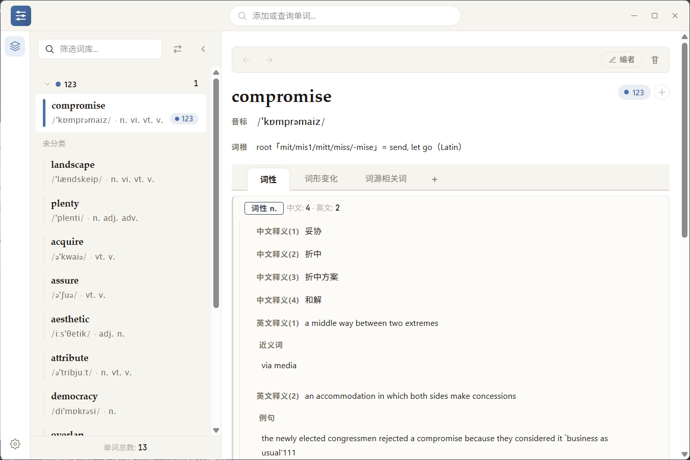
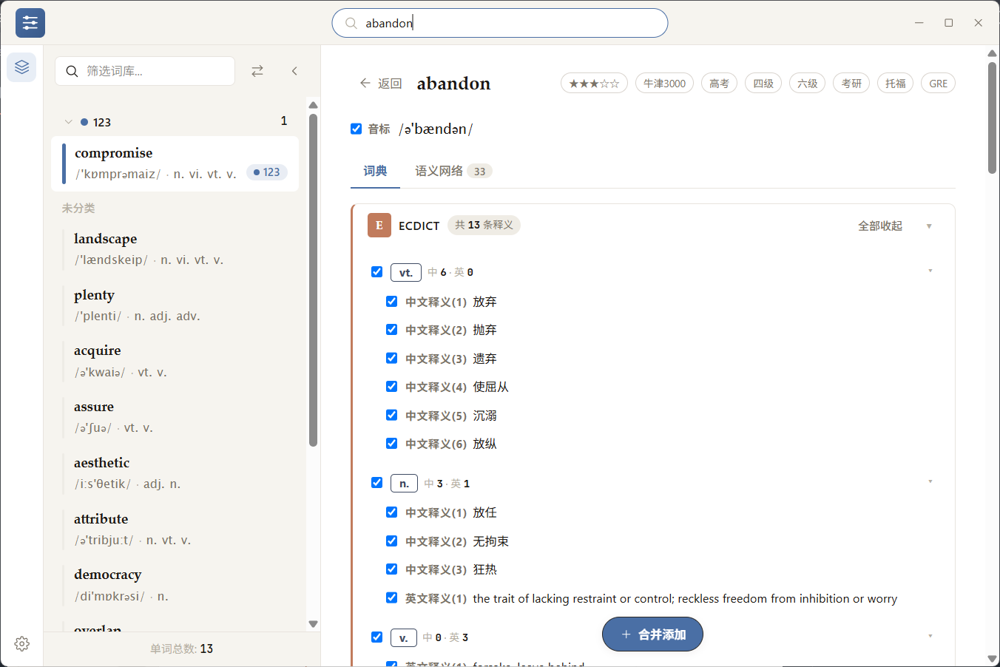
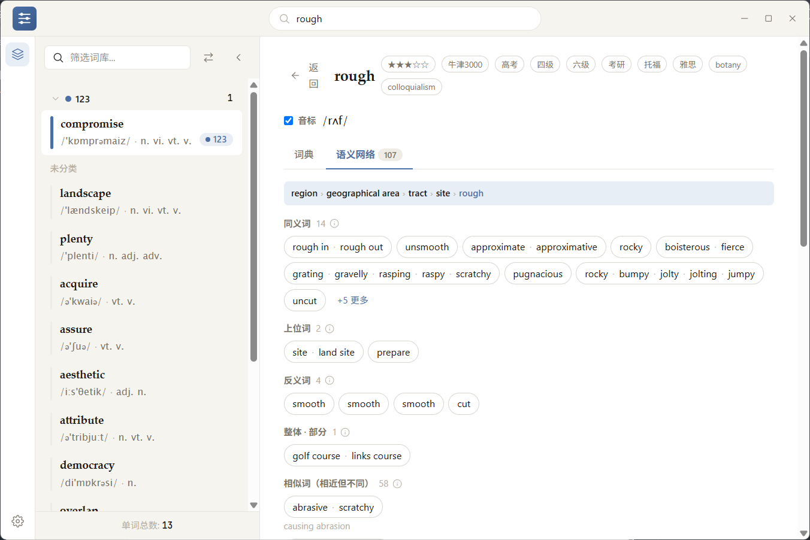
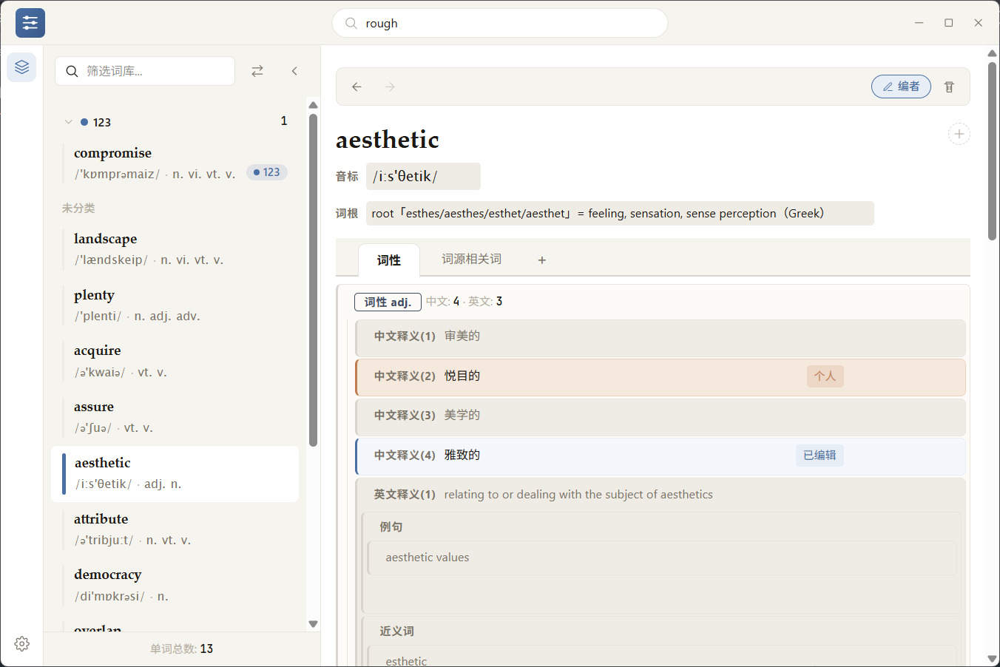
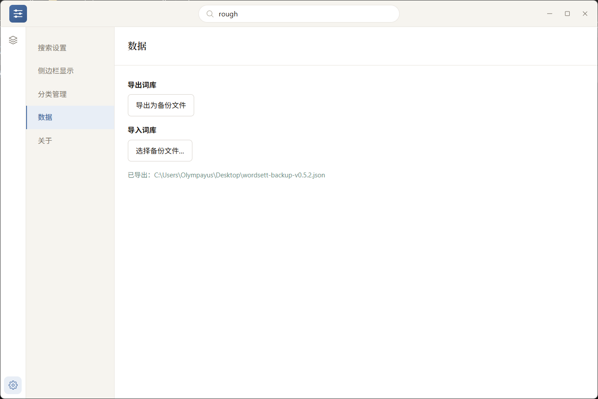

# Wordsett

> 离线优先的个人词汇知识库 —— 在本地构建、管理、不断充实属于你自己的词库。

Wordsett 是一款个人词汇知识管理桌面应用。它把**离线词典查询**、**词汇语义网络**与**结构化词汇管理**合二为一：搜索并合并 ECDICT / WordNet 的权威释义，借助 WordNet 语义关系构建词汇网络，再用分层字段、分类系统把你自己的理解沉淀成长期可复用的知识。

## 简介

背单词容易，沉淀单词难。Wordsett 把每一个词当作一条「知识条目」来经营：

- 从本地词典一键导入权威释义，再补上你自己的理解（例句、近义词、派生词、使用场景……）；
- 用**分类**组织词汇，用**分层字段**承载细节；
- 所有数据离线保存在本机，随时可以重新组织、重新挖掘。

它不是一个背单词打卡 App，而是你的**个人词汇知识库**。

## 特色

### 🔍 双离线词典搜索 · 中英互查
- 内置 **ECDICT + WordNet** 两套本地词典，查询**无需联网**；
- 输入英文单词联想建议 → 词性分组的详情树；
- **中文反查英文**：输入中文，从 ECDICT 中文释义反查匹配的英文单词，**常用词优先、完整释义匹配优先于复合词内含**（如搜「有趣的」先出 interesting/lovely，再出 episode/brain-teaser），输入法合成期不干扰搜索；
- 已在个人词库的词在**搜索建议**与**语义网络**中标记「✓ 已收录」，避免重复添加。
- ECDICT 提供音标、词性、中英释义、词形变化；WordNet 提供按词性分组的英文释义、近义词、例句、派生词。

> **说明**：设置面板中的「在线词典查询」目前仅为测试项，尚未内置在线搜索功能；实际搜索完全基于本地词典。

### 🧩 合并添加
在词典详情里勾选想要的字段，一键把 ECDICT + WordNet 的内容**合并进词库**；每张词典卡支持「**添加此词典**」一键整卡勾选，词性组**默认展开**、可折叠，卡片可「全部展开/收起」，勾选后浮动「**合并添加**」操作栏出现。

### 🕸️ 语义网络
基于 WordNet 语义关系，为每个词生成词汇关系网络：**同义词、上位词、下位词、相似词（相近但不同）、反义词、派生词、整体·部分、参见**分组；「相似词」每个相近词簇下方**常驻显示该簇释义**，悬停弹出完整 gloss 的应用内浮窗（一句一行）；顶部显示**上位词路径**，点任意胶囊**继续探索**该词，网络随词刷新。

### 💾 导入导出
词库可导出为**版本化 JSON 备份文件**；导入时**按 ID 合并**（保留更新的数据），导入前显示 **dry-run 预览**（新增/更新数量），为迁移与多端同步铺路。

### 📚 分层字段
**19 个内置字段**（音标、词性、中文/英文释义、例句、词形变化、近义词、派生词、短语、补充……）支持树形层级与拖拽排序，一个词性下可挂多条释义，释义下还可挂例句与近义词。

### 🧭 词性分组窗格
每个词性一个独立窗格，中/英释义**按词性独立编号**，蓝色标签标识词性，结构一目了然。

### ✍️ 三态字段编辑
每个字段区分**原始 / 已编辑 / 个人**三种状态：词典导入的原文、你修改过的内容、你原创的条目，一眼可辨；「编者模式」下可视化增删与重排。

### 🏷️ 分类系统
**8 种颜色**的分类胶囊，单词 ↔ 分类自由分配；侧边栏支持**字母 / 分类**双模式分组；设置面板内置**分类管理**。

### 🖱️ 右键快捷菜单
侧边栏右键单词即可快速编辑、添加到分类、从分类移除、删除；右键分类标题可编辑或删除分类。

### 🔒 离线优先 · 跨平台
所有词典与应用数据均存于本机，无账号、无云同步、无遥测；支持 Windows / macOS / Linux。

## 截图

**主界面 · 词库视图** —— 三栏布局

**词典返回页 · 词典 Tab** —— 双离线词典、词性组折叠、浮动合并添加

**语义网络 Tab** —— 关系分组与上位词路径

**词条编辑工作台** —— 词性分组窗格与三态字段编辑

**设置 · 数据** —— 词库导入导出

## 下载与安装

### 安装

前往 [GitHub Releases](https://github.com/Olympayus/Wordsett/releases) 下载对应系统的安装包：

| 系统 | 安装包 |
|------|--------|
| **Windows** | `Wordsett_0.4.4_x64-setup.exe`（当前发布提供；MSI 暂未随包） |
| **macOS** | `Wordsett_0.4.4_x64.dmg`（在 macOS 上构建） |
| **Linux** | `Wordsett_0.4.4_x86_64.AppImage` / `.deb`（在 Linux 上构建；暂未提供） |

下载后**双击运行安装程序**，跟随向导即可完成安装；开始菜单会出现 **Wordsett** 图标。

### 应用内更新

安装后无需手动卸载重装：启动时若检测到新版本会弹窗提示，也可在 **设置 → 关于 → 检查更新** 手动检测并直接升级；更新过程保留你的个人词库数据。

### 从源码构建（开发者）

> 开发者请参阅项目根目录的 `CLAUDE.md`（含环境准备、词典库生成、常用脚本）。

## 快速上手

1. **搜词** —— 顶栏输入英文或**中文**，选择联想建议。
2. **预览** —— 词典 Tab 查看 ECDICT / WordNet 详情，词性组可展开，勾选字段。
3. **探索** —— 切到「语义网络」Tab，沿上位词路径与关系胶囊继续探索相关词。
4. **加入词库** —— 点浮动「**合并添加**」整合多词源内容并跳转编辑页；也可用「添加此词典」整卡加入。
5. **沉淀** —— 在编辑页用「编者模式」补充释义、例句、近义词、派生词等分层字段。
6. **组织** —— 给单词分配彩色分类，在侧边栏按字母或分类浏览。
7. **备份** —— 设置 → 数据 → 导出词库为备份文件，需要时导入恢复。

## 卸载

**Windows**

- 方式一：`设置 → 应用 → 已安装的应用 → Wordsett → 卸载`；
- 方式二：`控制面板 → 程序 → 程序和功能 → Wordsett → 卸载`；
- 方式三：从开始菜单运行「卸载 Wordsett」。

**macOS**：将 `Wordsett.app` 拖入废纸篓。

**Linux**：使用发行版的软件包管理器移除（如 `sudo apt remove lexiloom`）。

> **注意**：卸载时勾选框可让你选择**是否同时删除个人数据**（词库数据库与设置）。默认不勾选，个人数据会保留，重装后仍可读回；勾选后彻底删除。备份只需复制 `lexiloom.db`。

## 数据与隐私

- **全部数据保存在本机**，无账号、无云端、无遥测。
- 词库数据库：`%APPDATA%\com.lexiloom.app\lexiloom.db`（Windows，macOS/Linux 位于对应的应用数据目录）。
- 应用设置：通过本地存储保存在应用数据目录中。
- 备份：直接复制 `lexiloom.db` 即可备份整个词库。

## 许可

**MIT License** —— 代码采用 MIT 协议开源（详见 [`LICENSE`](LICENSE)）。内置词典数据（ECDiCT / WordNet 3.0）保留各自的第三方许可与署名要求，见 LICENSE 文件的 Third-Party Notices 部分。
